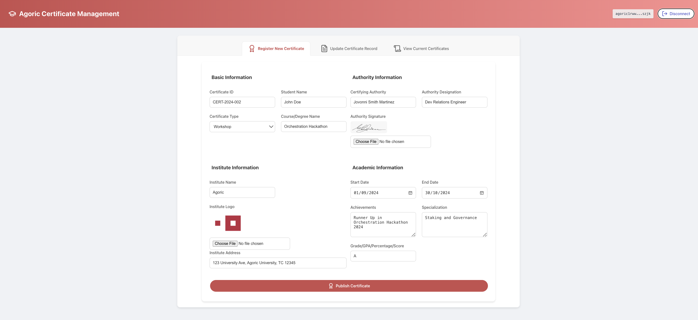

# Agoric Dapp: Dapp-Ed-Cert

Dapp-Ed-Cert is a simple Dapp for the [Agoric smart contract platform](https://docs.agoric.com/) that permits users to add educational certificates to the Agoric blockchain. This Dapp is designed for educational institutions, certification authorities, and students who need a secure and verifiable way to store and share educational credentials. 

Users are given a simple form in which to enter student's personal information and certification details. This data is then sent to the contract to be added to the Agoric VStorage, ensuring that the information is tamper-proof and easily accessible. By leveraging the Agoric blockchain, Dapp-Ed-Cert provides a transparent and reliable method for managing educational certificates, reducing the risk of fraud and simplifying the verification process for employers and other institutions.

_Note that this is a example dapp exploring capabilities of Agoric VStorage with no consideration made for privacy of information. All entered data maybe publicly visible._

This is the user interface of dapp:

<p align="center">
    
</p>

This is how the data looks like in VStorage:

<p align="center">
    
</p>

## Getting started
- run the `yarn install` command to install any solution dependencies. *Downloading all the required dependencies may take several minutes. The UI depends on the React framework, and the contract depends on the Agoric framework. The packages in this project also have development dependencies for testing, code formatting, and static analysis.*
- start a local Agoric blockchain using the `yarn start:docker` command.
- run `yarn docker:logs` to check the logs. Once your logs resemble the following, stop the logs by pressing `ctrl+c`.
```
demo-agd-1  | 2023-12-27T04:08:06.384Z block-manager: block 1003 begin
demo-agd-1  | 2023-12-27T04:08:06.386Z block-manager: block 1003 commit
demo-agd-1  | 2023-12-27T04:08:07.396Z block-manager: block 1004 begin
demo-agd-1  | 2023-12-27T04:08:07.398Z block-manager: block 1004 commit
demo-agd-1  | 2023-12-27T04:08:08.405Z block-manager: block 1005 begin
demo-agd-1  | 2023-12-27T04:08:08.407Z block-manager: block 1005 commit
```
- run `yarn start:contract` to start the smart contract. 
- run `yarn start:ui` to start the smart contract. You can use the link in the output to load the smart contract UI in a browser.

For any troubleshooting please refer to the detailed tutorial at [Here](https://docs.agoric.com/guides/getting-started/).

## Testing

To run the unit test:
- run `yarn test` to run the unit tests for the contract.
