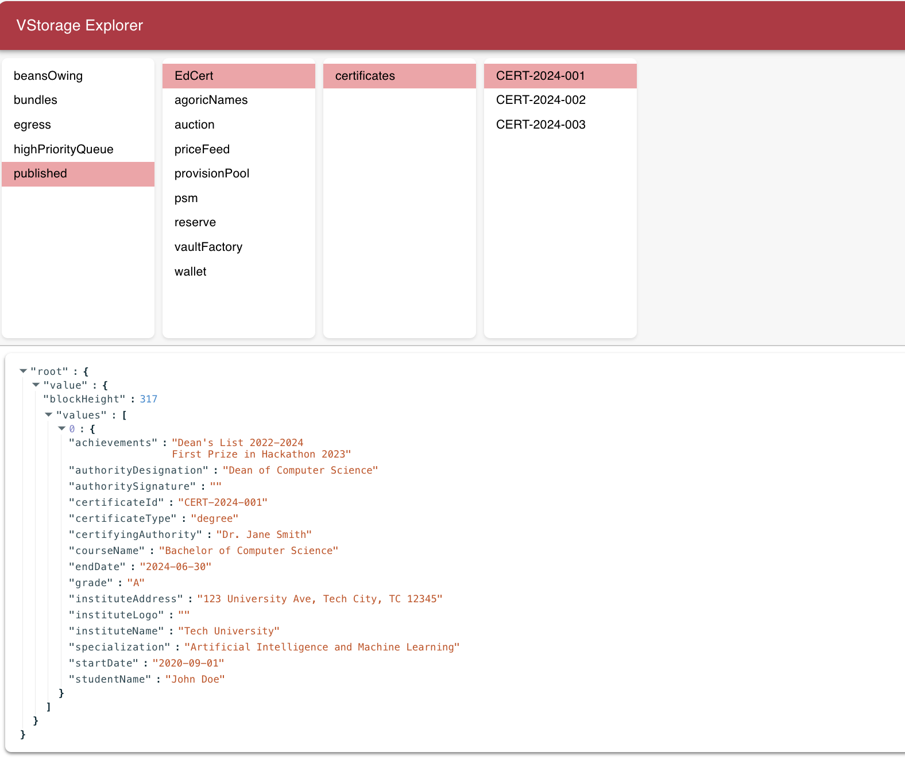

# Agoric Dapp Starter: Med Rec

Med Rec is a simple Dapp for the [Agoric smart contract platform](https://docs.agoric.com/) that permits users to add medical records, in particular patient data, to Agoric blockchain. Users are given a simple form in which to enter patient's personal and medical information, and this data is sent to the contract to be added to the Agoric VStorage.

_Note that this is a toy example dapp with no consideration made for privacy of sensitive information. All entered data maybe publicly visible depending on the hosting network of this dapp._

This is the user interface of dapp:

    

This is how the data looks like in VStorage:

    

## Getting started

Follow the instructions at `agoric-sdk/multichain-testing/README.md` to setup the environment. Once up and running, you can deploy the dapp with `make deploy` inside the `contract` directory.
